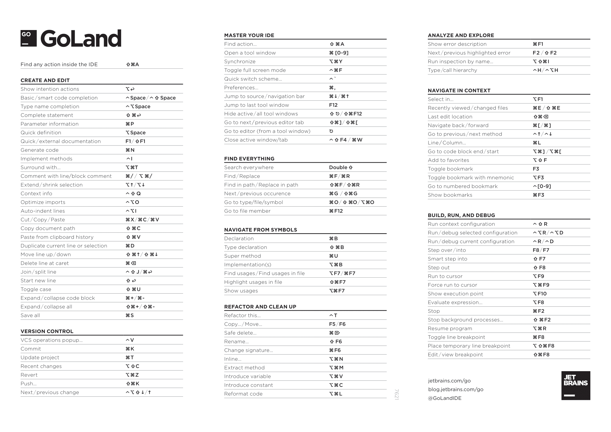

# IDE overview

## Что такое IDE?

Интегрированная среда разработки (IDE) – это программное приложение, которое помогает программистам эффективно
разрабатывать программный код. Оно повышает производительность разработчиков, объединяя такие возможности, как
редактирование, создание, тестирование и упаковка программного обеспечения в простом для использования приложении. Так
же как писатели используют текстовые редакторы, а бухгалтеры – электронные таблицы, разработчики программного
обеспечения применяют IDE, чтобы упростить свою работу.

## Почему IDE важна?

Для написания кода можно использовать любой текстовый редактор. Однако большинство интегрированных сред разработки (IDE)
включают в себя функции, выходящие за рамки редактирования текста. Они предоставляют центральный интерфейс для общих
инструментов разработчика, делая процесс разработки программного обеспечения гораздо более эффективным. Разработчики
могут быстро приступить к программированию новых приложений вместо того, чтобы вручную интегрировать и настраивать
различное программное обеспечение. Кроме того, им не нужно изучать все инструменты, а можно сосредоточиться только на
одном приложении.

Ниже перечислены некоторые причины, по которым разработчики используют IDE:

### Автоматизация редактирования кода

В языках программирования существуют правила структурирования утверждений. Поскольку IDE знает эти правила, она
содержит множество интеллектуальных функций для автоматического написания или редактирования исходного кода.

### Выделение синтаксиса

IDE может форматировать написанный текст, автоматически выделяя некоторые слова жирным или курсивом либо используя
различные цвета шрифта. Эти визуальные подсказки делают исходный код более читабельным и мгновенно информируют о
случайных синтаксических ошибках.

### Интеллектуальное завершение кода

Когда вы начинаете набирать слова в поисковой системе, появляются различные поисковые запросы. Аналогичным образом IDE
может предлагать завершить ввод кода, когда разработчик начинает набирать текст.

### Поддержка рефакторинга

Рефакторинг кода – это процесс реструктуризации исходного кода с целью сделать его более эффективным и читаемым без
изменения его основной функциональности. IDE могут в некоторой степени использовать авторефакторинг, позволяя
разработчикам быстро и легко улучшать свой код. Другие члены команды быстрее понимают читаемый код, что способствует
сотрудничеству внутри команды.

### Автоматизация локальной сборки

IDE повышают производительность труда программистов, выполняя повторяющиеся задачи разработки, которые обычно являются
частью каждого изменения кода. Ниже приведены примеры регулярных задач кодирования, которые выполняет IDE.

### Компиляция

IDE компилирует или преобразует код в упрощенный язык, понятный операционной системе. Некоторые языки программирования
реализуют компиляцию «точно в срок», при которой IDE преобразует понятный при прочтении код в машинный код внутри
приложения.

### Тестирование

IDE позволяет разработчикам автоматизировать модульные тесты локально, прежде чем программное обеспечение будет
интегрировано с кодом других разработчиков и будут запущены более сложные интеграционные тесты.

### Отладка

Отладка – это процесс исправления любых ошибок или недочетов, которые выявляет тестирование. Одна из самых больших
ценностей IDE для целей отладки заключается в том, что вы можете построчно просматривать код, по мере его выполнения и
проверять поведение кода. В IDE также встроено несколько инструментов отладки, которые выявляют неполадки, вызванные
человеческими ошибками, в режиме реального времени, даже когда разработчик набирает текст.

### Кастомизация

IDE позволяет разработчикам встраивать собственные инструменты и плагины, которые могут быть настроены для выполнения
любых задач, которые вы можете придумать.
Так же можно настроить цветовую схему, шрифты, размеры окон и многое другое.

### Интеграция

IDE позволяет разработчикам интегрировать их среду разработки с другими инструментами, такими как системы контроля
версий, системы управления задачами, системы управления проектами и т.д.
Часто IDE имеют встроенные инструменты для интеграции с другими системами, но также можно использовать плагины для этой
цели.

## Какие виды IDE существуют?

Интегрированные среды разработки (IDE) можно разделить на несколько различных категорий в зависимости от того, какую
разработку приложений они поддерживают и как работают. Однако многие программные приложения IDE можно отнести к
нескольким категориям. Ниже представлены некоторые типы IDE.

### Локальные IDE

Разработчики устанавливают и запускают локальные IDE непосредственно на своих локальных машинах. Им также приходится
загружать и устанавливать различные дополнительные библиотеки в зависимости от их предпочтений в кодировании, требований
проекта и языка разработки. Хотя локальные IDE являются настраиваемыми и не требуют подключения к Интернету после
установки, они сопряжены с несколькими проблемами.

- Их установка может отнимать много времени и быть сложной.
- Они потребляют локальные ресурсы машины и могут значительно замедлить ее работу.
- Различия в конфигурации между локальной машиной и производственной средой могут привести к ошибкам в программном
  обеспечении.

### Облачные IDE

Разработчики используют облачные IDE для написания, редактирования и компиляции кода непосредственно в браузере, что
избавляет их от необходимости загружать программное обеспечение на локальные машины. Облачные IDE имеют ряд преимуществ
перед традиционными. Некоторые из них указаны ниже.

#### Стандартизированная среда разработки

Команды разработчиков программного обеспечения могут централизованно настроить облачную IDE для создания стандартной
среды разработки. Этот метод помогает им избежать ошибок, которые могут возникнуть из-за различий в конфигурации
локальной машины.

#### Независимость от платформы

Облачные IDE работают в браузере и не зависят от локальных сред разработки. Это означает, что они подключаются
непосредственно к облачной платформе поставщика, поэтому разработчики могут использовать их с любой машины.

#### Улучшенная производительность

Создание и компиляция функций в IDE требует много памяти и может замедлить работу компьютера разработчика. Облачная
IDE использует вычислительные ресурсы из облака и освобождает ресурсы локальной машины.

> Большая часть из: https://aws.amazon.com/ru/what-is/ide/

# Shortcuts

> Based on Goland IDE from JetBrains

